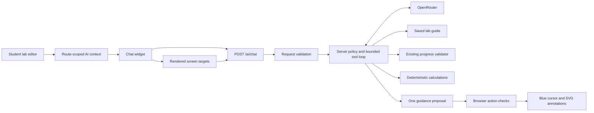

# Cogni Lab AI agent

## Purpose and scope

The assistant supports students with experiment steps, equipment setup, circuit troubleshooting, theory, calculations and interpretation of readings. It uses the existing chat interface, NestJS backend and OpenRouter integration. There is no separate agent framework, vector database or persistent conversation database.

The agent reads lab information and checks the current student workspace. Its visual guidance skill can point to controls, circle equipment or wires, draw an arrow and open learning views when explicitly requested. It cannot place equipment, change wires or settings, mark steps complete, submit attempts, save grades or run an electrical simulation. Students remain in control of those actions. The tutoring policy calls for progressive hints rather than a complete worked experiment or answer sheet.

The **Get Help** reference dialog has been removed from both lab editors; the assistant is the student's help. The circuit validation and attempt services from `feature/multi-topology-circuit-validation` supply the same checks used by **Check Progress**. AI implementation changes are confined to `backend/src/ai`, the AI widget/context/overlay, this documentation and minimal context or target metadata in the student dashboard, editor and instructor help dialog. Upstream changes and tests remain owned by their original features.

## Architecture



| Component | Responsibility |
| --- | --- |
| `frontend/components/ai-chat-widget.tsx` | Conversation UI, authentication token, cancellation, retry, session history and successful-check indicators |
| `frontend/components/ai-message-content.tsx` | Restricted Markdown rendering and readable assistant message typography |
| `frontend/lib/ai-context.ts` | Route-isolated page context, page excerpt cleanup and bounded request construction |
| `frontend/lib/ai-guidance.ts` | Collect rendered targets, retain local element references and validate guidance before execution |
| `frontend/components/ai-guidance-overlay.tsx` | Independent blue cursor, target tracking, circle/arrow drawing, dismissal and cancellation |
| `frontend/hooks/use-ai-page-context.ts` | Publish page context and remove it when its owner unmounts |
| `frontend/app/student/lab/[id]/student-lab-editor.tsx` | Publish placed component identities, live wires, current step and completed step ids |
| `backend/src/ai/ai-request.ts` | Validate incoming messages and workspace structure at runtime |
| `backend/src/ai/ai-prompt.ts` | Backend-owned tutoring policy and evidence requirements |
| `backend/src/ai/ai.service.ts` | Provider requests, tool loop, deadlines, limits and error mapping |
| `backend/src/ai/ai-tools.service.ts` | Load saved lab data, validate equipment membership and dispatch read-only tools |
| `backend/src/ai/ai-calculations.ts` | Supported formulas and numerical input checks |
| `backend/src/ai/ai-guidance.ts` | Visual skill instructions, tool schema, safe route list and proposal checks |

The global Clerk authentication guard protects the AI endpoint. The AI module imports the existing lab module and provides the existing read-only attempt service with Prisma. Lab reads follow the application's current lab-access policy; this change does not introduce a new permission system.

## Data and tutoring behavior

The browser supplies workspace identities and wire endpoints, not trusted component values, grading rules or instructions. The backend reads equipment labels, configuration, procedures, tolerances and validation rules from the saved lab. It checks that every supplied component belongs to that lab. This preserves the distinction between the student's actual circuit and the instructor's reference circuit.

The selected step is supplied with its full procedure and tolerance fields, subject to documented text limits. The assistant starts with a useful hint when a student is stuck, explains why a step matters and provides a fuller answer when requested. It can direct the student to the step list for instructions, **Wire Mode** for connections, **Check Progress** for an unsaved check and **Submit** for an actual submission.

The assistant speaks as a patient teaching helper: natural contractions, plain explanations and acknowledgement of frustration without scripted greetings or unsupported praise. It begins with a direct answer and uses up to three short sections when the question needs them. Troubleshooting focuses on one evidenced issue and a manageable check. Calculations separate inputs, formula and result, with explicit units and provenance. Responses normally stay under 180 words; short questions do not require a fixed template. Visual guidance reasons address the student directly, and guidance-only replies follow the same conversational style without an additional model call.

Assistant messages render paragraphs, restrained headings, emphasis, numbered steps, bullets and formula blocks. All heading levels use the same compact section treatment in the chat. Formulas can scroll horizontally, long text wraps and check metadata appears as small badges beneath the answer. User messages remain literal text. Existing plain-text session history still displays with preserved line breaks. The welcome message, progress text and input prompt use the same teaching tone.

Claims about circuit correctness should use `inspect_workspace`. Every lab is validated with circuit rules (labs without saved rules use the defaults), so results describe the circuit graph, the lab's criteria and the comparison with the instructor's circuit. Validation does not supply real instrument readings, and steps are instructions, not graded progress.

Measurement interpretation uses student-provided readings and the selected step's tolerances, falling back to lab tolerances when appropriate. The model must ask for missing values or incompatible units. Supported calculations are performed by code, while explanations, unit conversion and selection of appropriate inputs remain model responsibilities.

Instructor pages continue to provide their lab identity. The tools consult the saved instructor design; unsaved instructor edits are not available to the tools. General pages support learning questions and a short page excerpt without claiming a live circuit is available.

## Visual guidance skill

Examples: **Where is Get Help?**, **Open Ohm's Law lab**, **Draw an arrow to Wire Mode**, or **Circle the issue in my circuit**. Location questions highlight a target and leave the action to the student. The assistant can open a listed lab, dashboard, module/equipment view, navigation tab or instructor help guide after an explicit navigation request. Short confirmations such as **yeah that one** are also recognized immediately after the assistant replies to a navigation request, provided one current target is named in that request or reply. Both server and browser enforce this same consent rule. An unrelated **yes**, an invented destination, multiple named destinations or a declined request cannot authorize the click. It opens a lab view through the app router; it does not invoke the experiment button's business handler. Ambiguous destination names require clarification.

The browser collects a bounded inventory of rendered controls, canvas components, terminals when relevant, wires and headings. Each request creates fresh target ids and retains their element references locally. The model receives labels, kinds and allowed actions, with component identities for troubleshooting. It receives no screenshots, screen coordinates, arbitrary selectors or executable browser code. The inventory is sent for guidance, navigation, troubleshooting, page-orientation questions and immediate navigation confirmations, and replaces the redundant page excerpt. Short follow-ups rescan the current screen rather than reusing old target ids. Instructor lab links also carry their lab names as AI-only target metadata. Controls hidden by their ancestors are excluded. Conversation history is reduced to the latest 12 messages. A successful guidance-only tool turn returns immediately without another inference just to write a response.

The server policy tells the model that it can open permitted views through `guide_ui`, to distinguish missing targets from a general inability to navigate, and to describe the current instructor/student role's controls. It must not invent lab or module examples or treat an earlier assistant suggestion as evidence that a destination exists. A bare lab-name reply after clarification selects only an exact current option. Navigation intent carries through at most three short clarification turns and stops when the student declines or asks an unrelated question. If a target is behind an unopened tab, the assistant can offer that tab as the next navigation step; it cannot perform an autonomous sequence into an unseen lab.

If a short confirmation does not identify one actual target, the server returns a clarification listing up to four current options directly, without a model inference. This prevents a model from resolving an unverified earlier example to an unrelated real lab and reduces tokens for ambiguous follow-ups.

`guide_ui` proposes one target with a mode, purpose and short explanation. The server rejects unsupported targets, experiment clicks, unrequested navigation and error annotations without a prior workspace inspection reporting a failed circuit rule check or warning. Incomplete steps and legacy count checks cannot authorize a circuit-error annotation. Issue annotations must target a component, terminal or wire. The skill instructs the model to match that target to actual validator evidence and describe one issue at a time. A valid proposal is not proof of a correct diagnosis; students should compare the explanation with the lab guide and validator. When no precise issue is established, the assistant can highlight a place to inspect with purpose `locate` and explain the uncertainty.

Before displaying a proposal, the browser checks the current route, unchanged workspace, connected/rendered element and request cancellation. Before clicking, it checks the target's current capability, label, destination and visibility again. Navigation uses an allowlisted internal route; help clicks are confined to the student editor's marked help button; tab activation is confined to dashboard or instructor-reference navigation. Other controls are highlight-only. Changing the screen or workspace prevents a stale action from being executed.

The overlay uses a glowing blue SVG cursor and non-interactive SVG annotations. It never moves the student's real cursor, drags components or focuses a lab control. It follows target bounds during scrolling and canvas movement, and scrolls an offscreen target into view when possible. Circles use an animated uneven stroke; arrows point at the target. Guidance fades after eight seconds. Requested clicks wait one second while the target is shown. **Escape**, **Dismiss**, **Stop**, **New chat**, a new guidance request, route changes or cancellation remove the overlay and prevent a pending click. The chat closes if it would obscure the target. Reduced-motion preferences disable cursor transitions and drawing animation.

There is no arbitrary freehand drawing or autonomous sequence across multiple pages. If an element is missing, hidden, inside an unopened tab, or outside the bounded inventory, the assistant must ask the student to open the relevant view or give a manual next step. It cannot automatically find an offscreen canvas component by changing canvas zoom or repairing its wiring.

## API contract

`POST /ai/chat` requires `Authorization: Bearer <Clerk token>` and a JSON body.

```json
{
  "messages": [
    { "role": "user", "content": "Help troubleshoot my circuit" }
  ],
  "context": {
    "route": "/student/lab/<lab-id>",
    "labId": "<lab-id>",
    "currentStepIndex": 0,
    "completedStepIds": [],
    "workspace": {
      "components": [
        {
          "id": "<student-component-id>",
          "equipmentId": "<equipment-id>",
          "labEquipmentId": "<instructor-placement-id>"
        }
      ],
      "connections": []
    }
  }
}
```

`context` is optional for general questions. Its optional `pageTitle` and `pageText` fields are short browser excerpts. The last message must be from the user. Client `system` and `tool` roles are rejected; privileged instructions are generated only on the backend. Unknown context properties are discarded. The old client-built system-message payload must be updated with this backend change.

Successful responses preserve the existing `reply` property and add check metadata:

```json
{
  "reply": "R1 is not connected. Check its terminals before checking progress again.",
  "toolsUsed": ["inspect_workspace"]
}
```

`toolsUsed` contains known tools that returned available results. Failed or unavailable checks do not produce a successful-check indicator. Responses use Nest's existing POST success status, 201.

Visual requests may include `context.screen.targets`, an array of `{ id, label, kind, action, href?, componentId? }`. Kinds are `control`, `component`, `wire`, `terminal` and `section`. Allowed actions are `show`, `navigate`, `help` and `tab`; non-controls allow only `show`. Navigation targets require an allowlisted internal `href`. Client capabilities are rechecked against actual DOM elements in the browser before execution.

A guidance response additionally includes:

```json
{
  "reply": "I'll show you Get Help. This opens the instructor reference guide.",
  "toolsUsed": ["guide_ui"],
  "guidance": {
    "targetId": "s1_0",
    "mode": "point",
    "purpose": "locate",
    "reason": "This opens the instructor reference guide."
  }
}
```

Modes are `point`, `circle`, `arrow` and `click`; purposes are `locate`, `issue` and `navigate`. A click requires `navigate`. The reason is limited to 180 characters. Proposals are not stored in session history or replayed after reload. The server does not receive an action-success acknowledgement and does not claim completed browser actions.

| Status | Meaning |
| --- | --- |
| 400 | Invalid messages, context, wire references or equipment membership |
| 401 / 403 | Existing authentication or authorization failure |
| 404 | Requested lab does not exist |
| 429 | Provider rate limit; retry later |
| 502 | Empty/malformed provider response or excessive tool calls |
| 503 | Missing configuration, unavailable provider or network failure |
| 504 | Provider/tool-loop deadline reached |

Provider response bodies, credentials and conversation content are not included in diagnostic logs. Logs record provider HTTP status or a generic network failure.

## Tools and limits

| Tool | Inputs and result |
| --- | --- |
| `inspect_lab` | No arguments. Saved procedures, labels, selected configuration fields, tolerance ranges, reference wires and rules |
| `inspect_workspace` | No arguments. Actual placed components, terminals, valid completed-step count and the existing progress-validator result. Repeated checks within one request reuse the result |
| `calculate` | `operation` plus the fields listed below. Returns formulas, units, assumptions or comparison provenance |
| `guide_ui` | Available only with a screen inventory. `targetId`, `mode`, `purpose`, `reason`; proposes one annotation or explicitly requested safe navigation action |

Supported calculation operations:

- `ohms_law`: exactly two of `voltageV`, `currentA`, `resistanceOhms`; returns all three and `powerW` using `V = I × R` and `P = V × I`.
- `series_resistance`: `resistancesOhms`; uses the sum of resistances.
- `parallel_resistance`: `resistancesOhms`; uses the reciprocal-sum formula with a scaled calculation to reduce numerical overflow.
- `compare_measurement`: `reading`, `minimum`, `maximum`, `unit`; compares inclusive bounds in a common unit and labels the reading as student-provided.

Resistances must be positive; numeric inputs and results must be finite. Resistance arrays accept 1–50 values. No model-supplied code or arbitrary expressions are evaluated.

| Boundary | Limit |
| --- | --- |
| Incoming messages | 24; 4,000 characters each; 24,000 characters total |
| Browser history sent | Latest 12 messages, trimmed to 12,000 characters |
| Displayed/stored history | Latest 40 messages per user and route |
| Page excerpt | 1,800 characters; excludes chat, scripts, styles, navigation and form inputs |
| Screen inventory | Up to 60 unique targets; labels 100 characters; browser payload below 9,500 characters; server accepts up to 10,000 |
| Visual guidance | One target per answer; 1-second click dwell; 8-second annotation lifetime |
| Workspace | 100 uniquely identified components and 200 wires referencing placed components |
| Completed step ids | 100; deduplicated and checked against saved lab steps |
| Guide data | Up to 100 steps, 100 equipment placements and 200 reference wires; descriptions/procedures are bounded |
| Provider/tool loop | Up to 4 model turns and 6 tool calls; final turn disables additional calls |
| Provider output | 1,200 tokens per turn; reply capped at 4,000 characters |
| Deadline | Shared 60-second provider/tool-loop deadline; browser request times out at 70 seconds |

Cancellation stops the browser request and pending guidance click. Backend lab tools remain read-only and subject to their deadline. No automatic submission or grade change occurs.

## Configuration

| Variable | Purpose |
| --- | --- |
| `OPENROUTER_API_KEY` | Required backend provider credential |
| `OPENROUTER_MODEL` | Optional preferred model; must support function calling |
| `OPENROUTER_APP_URL` | Optional provider attribution URL; otherwise `FRONTEND_URL` or localhost |
| `OPENROUTER_APP_NAME` | Optional attribution name; default `Cogni Lab` |
| `NEXT_PUBLIC_API_BASE_URL` | Existing frontend backend URL |

When no preferred model is configured, the agent uses `openrouter/free`. If the configured model returns HTTP 400 or 404 on the first inference, it retries once through that free router. It does not silently select a paid model. Other failures use the error handling above. Free-model capacity and answer quality may vary.

Provider implementation follows [OpenRouter's tool-calling contract](https://openrouter.ai/docs/guides/features/tool-calling). The [free models router](https://openrouter.ai/openrouter/free) selects models compatible with the requested features. Tool definitions accompany every inference, and provider reasoning details are preserved between tool turns when supplied.

The merged validation feature requires its existing Prisma migration, `20261003111015_circuit_validation`, to be applied by the team's normal migration process before using those services. The agent adds no schema migration. The frontend adds `react-markdown` for the AI message renderer; no raw-HTML, math, syntax-highlighting or other Markdown plugins are used.

## Local preview build

Use the team's normal environment files and database setup. The frontend requires `NEXT_PUBLIC_API_BASE_URL=http://localhost:3001`; the backend requires its OpenRouter and Clerk credentials. Keep environment files and the local SQLite database untracked.

The normal frontend build currently stops at the unrelated onboarding type error described below. For a local preview without changing that code, run both webpack build phases from `frontend`:

```powershell
npm run build -- --webpack --experimental-build-mode compile
npm run build -- --webpack --experimental-build-mode generate-env
npm run start -- --hostname :: --port 3000
```

The `generate-env` phase embeds public environment values in browser bundles. Omitting it leaves the AI API URL unresolved in the browser, even when `.env.local` is correct. This preview workflow skips full frontend type checking; it is not a replacement for resolving the team's existing type error before a normal production build.

Build the backend with `npm run build`. In this checkout the generated Prisma sources cause compiled files to appear under `dist/src`; its existing bare `generated/prisma/enums` import also needs the build directory on Node's module path. From `backend`, start it with:

```powershell
$env:NODE_PATH = (Resolve-Path ./dist).Path
node ./dist/src/main.js
```

The frontend runs at `http://localhost:3000` and the backend at `http://localhost:3001`. Apply the validation migration to the local database before opening a lab. If using a copy of the historical tracked database, verify its existing schema and baseline the initial migration before applying the new migration; do not recreate existing tables.

## Conversation lifecycle and privacy

History is stored in browser `sessionStorage`, keyed by signed-in user and route. It survives reloads within the same tab. Lab changes create separate conversations; returning to a lab restores that lab's session. **New chat** clears the active conversation. A user change remounts the session, preventing the previous user's history from appearing.

The route context is replaced rather than merged with old lab data, and unmount cleanup removes it. A route mismatch also prevents stale context from being read. The API receives bounded conversation text, current workspace identifiers and a short page excerpt. It does not receive the Clerk user profile, credentials or unrelated lab records. API keys remain on the server.

Model replies are rendered with `react-markdown` using an explicit allowlist of text-formatting elements and `skipHtml`. Raw HTML is ignored; links become their label text and images are omitted. There are no executable HTML, embedded resources or model-generated clickable links in answers. React escapes text, including code blocks. User messages render directly as React text. Page and lab text are treated as data, and the backend policy instructs the model to disregard embedded attempts to override it. These controls reduce errors but do not guarantee the correctness of every generated explanation.

## Validation record

Validated on 2026-10-05:

- Backend build and ESLint checks for the AI files.
- Type checking and ESLint for the standalone frontend AI files.
- The merged circuit-validator and lab-attempt suites: 36 existing tests.
- Temporary backend checks for request rejection, equipment membership, real read-only lab/validator integration, formulas, tolerance boundaries, provider tool loops, failure recovery, limits, fallback, module wiring and HTTP validation.
- Temporary DOM interaction checks for live context, retry without duplicating a question, stop/retry, per-lab history, new chat, readable steps, text-only rendering and history limits.
- A live synthetic OpenRouter calculation check. The configured model returned 404; the free-router retry used `calculate` and returned 0.005 A / 5 mA for 5 V across 1,000 Ω.
- Ten temporary guidance checks covering safe action boundaries, ambiguous destinations, rejected/oversized inventories, single-inference guidance, inspected error evidence, rejected legacy/step-only diagnoses, hidden controls, canvas terminals/straight wires, changed routes/workspaces/labels/destinations, post-animation rechecks and cancellation. The React overlay check verified blue SVG drawing, moving target bounds, Escape cancellation and the delayed navigation action.
- Live synthetic provider checks returned a point proposal for **Where is Get Help?** and an allowed navigation proposal for **Open Ohm Lab**. The configured model again returned 404; the existing free-router fallback handled both requests.
- Six temporary presentation checks covered semantic answer structure, formula scrolling, plain-text history, Markdown preservation through the server/chat/session flow, evidence badges, user text escaping and exclusion of raw HTML, scripts, links and images. AI frontend type checking, ESLint and the backend build passed. A live synthetic teaching question returned a concise explanation with emphasized labels, formula/substitution blocks and a focused follow-up question through the existing provider fallback.
- Eight temporary follow-up checks reproduced **can you open it for me? → named clarification → yeah that one**, verified fresh screen inventories and contextual consent in both server and browser, and rejected invented/ambiguous destinations, unrelated or declined confirmations, duplicate names and experiment clicks. Bare lab-name answers can select an exact current option after a navigation clarification; intent carries across at most three short clarification turns and stops on declined requests or unrelated questions. Unresolved confirmations return real screen choices directly without an inference or guidance proposal.
- Live synthetic follow-up verification returned a navigation proposal for the named lab and a direct list of real options when the earlier example was unavailable. The existing free-router fallback handled the named case after the configured model returned 404; the unresolved case needed no provider call.

The added validation scripts and fixtures were removed after use and are not part of the commits. Existing upstream tests were preserved.

The full frontend type check remains blocked by a pre-existing Zod 4 `required_error` incompatibility in `frontend/lib/schemas/onboarding.ts`. That file is outside the AI scope and was not changed. A browser connection was unavailable, so visual layout and a real Clerk-authenticated end-to-end lab session were not verified. The DOM checks use fixture authentication and provider responses; they do not replace that manual acceptance pass.

Recommended manual acceptance after the normal migration and app startup: open a student lab, place and wire equipment, ask for a hint and a setup check, request a calculation and a reading comparison, open **Get Help**, then switch labs and return. Confirm the agent describes current work, separates reference wiring from actual wiring and leaves submission decisions to the student.

For visual guidance, ask where **Get Help** is, request an arrow to **Wire Mode**, ask to open a named visible lab and cancel a navigation proposal with **Escape**. Ask to circle a validator-supported connection issue, then ask the assistant to fix the wiring or click **Submit**. It should explain or highlight while leaving those experiment actions to the student. Verify that scrolling, canvas movement and opening the chat do not let the overlay obscure or intercept normal lab interactions.

## Check Progress feedback

**Check Progress** opens the results dialog with the validator's checks and, at the top, a short AI explanation.

- The editor calls `POST /ai/progress-feedback` alongside the normal validation request. It sends the same body shape as the chat context (`labId`, `currentStepIndex` and the workspace's part identities and wires).
- The backend validates the workspace again with `inspect_workspace`. The model therefore sees only server-side evidence, never a result supplied by the browser. It makes one model call without tools, using the tutoring policy plus `PROGRESS_FEEDBACK_PROMPT`: a verdict, then the one or two most important issues with a concrete next step, as a hint rather than a full answer.
- If the assistant is unavailable or not configured, the dialog says so and the checks are still shown. Only the latest check's feedback is displayed.
- Every Check Progress click makes one model request. Keep this in mind for provider cost and rate limits.
