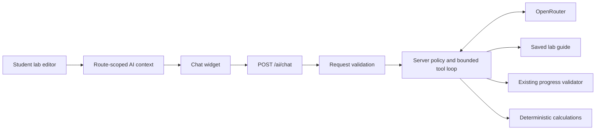

# Cogni Lab AI agent

## Purpose and scope

The assistant supports students with experiment steps, equipment setup, circuit troubleshooting, theory, calculations and interpretation of readings. It uses the existing chat interface, NestJS backend and OpenRouter integration. There is no separate agent framework, vector database or persistent conversation database.

The agent reads lab information and checks the current student workspace. It cannot place equipment, change wires or settings, mark steps complete, submit attempts, save grades or run an electrical simulation. Students remain in control of those actions.

The instructor reference guide from `dev_hansadee` remains available through **Get Help**. The circuit validation and attempt services from `feature/multi-topology-circuit-validation` supply the same checks used by **Check Progress**. AI implementation changes are confined to `backend/src/ai`, the AI widget/context/hook, this documentation and the context integration in the active student editor. Upstream changes and tests remain owned by their original features.

## Architecture



| Component | Responsibility |
| --- | --- |
| `frontend/components/ai-chat-widget.tsx` | Conversation UI, authentication token, cancellation, retry, session history and successful-check indicators |
| `frontend/lib/ai-context.ts` | Route-isolated page context, page excerpt cleanup and bounded request construction |
| `frontend/hooks/use-ai-page-context.ts` | Publish page context and remove it when its owner unmounts |
| `frontend/app/student/lab/[id]/student-lab-editor.tsx` | Publish placed component identities, live wires, current step and completed step ids |
| `backend/src/ai/ai-request.ts` | Validate incoming messages and workspace structure at runtime |
| `backend/src/ai/ai-prompt.ts` | Backend-owned tutoring policy and evidence requirements |
| `backend/src/ai/ai.service.ts` | Provider requests, tool loop, deadlines, limits and error mapping |
| `backend/src/ai/ai-tools.service.ts` | Load saved lab data, validate equipment membership and dispatch read-only tools |
| `backend/src/ai/ai-calculations.ts` | Supported formulas and numerical input checks |

The global Clerk authentication guard protects the AI endpoint. The AI module imports the existing lab module and provides the existing read-only attempt service with Prisma. Lab reads follow the application's current lab-access policy; this change does not introduce a new permission system.

## Data and tutoring behavior

The browser supplies workspace identities and wire endpoints, not trusted component values, grading rules or instructions. The backend reads equipment labels, configuration, procedures, tolerances and validation rules from the saved lab. It checks that every supplied component belongs to that lab. This preserves the distinction between the student's actual circuit and the instructor's reference circuit.

The selected step is supplied with its full procedure and tolerance fields, subject to documented text limits. The assistant starts with a useful hint when a student is stuck, explains why a step matters and provides a fuller answer when requested. It can direct the student to **Get Help** for the instructor's reference, **Wire Mode** for connections, **Check Progress** for an unsaved check and **Submit** for an actual submission.

Claims about circuit correctness should use `inspect_workspace`. Rule-based results can describe the supported topology and instructor criteria. Legacy results check equipment, counts and steps; they do not establish electrical correctness. Neither mode supplies real instrument readings. Completed steps are student-reported progress.

Measurement interpretation uses student-provided readings and the selected step's tolerances, falling back to lab tolerances when appropriate. The model must ask for missing values or incompatible units. Supported calculations are performed by code, while explanations, unit conversion and selection of appropriate inputs remain model responsibilities.

Instructor pages continue to provide their lab identity. The tools consult the saved instructor design; unsaved instructor edits are not available to the tools. General pages support learning questions and a short page excerpt without claiming a live circuit is available.

## API contract

`POST /ai/chat` requires `Authorization: Bearer <Clerk token>` and a JSON body.

```json
{
  "messages": [
    { "role": "user", "content": "Help troubleshoot my circuit" }
  ],
  "context": {
    "route": "/student/lab/<lab-id>",
    "labId": "<lab-id>",
    "currentStepIndex": 0,
    "completedStepIds": [],
    "workspace": {
      "components": [
        {
          "id": "<student-component-id>",
          "equipmentId": "<equipment-id>",
          "labEquipmentId": "<instructor-placement-id>"
        }
      ],
      "connections": []
    }
  }
}
```

`context` is optional for general questions. Its optional `pageTitle` and `pageText` fields are short browser excerpts. The last message must be from the user. Client `system` and `tool` roles are rejected; privileged instructions are generated only on the backend. Unknown context properties are discarded. The old client-built system-message payload must be updated with this backend change.

Successful responses preserve the existing `reply` property and add check metadata:

```json
{
  "reply": "R1 is not connected. Check its terminals before checking progress again.",
  "toolsUsed": ["inspect_workspace"]
}
```

`toolsUsed` contains known tools that returned available results. Failed or unavailable checks do not produce a successful-check indicator. Responses use Nest's existing POST success status, 201.

| Status | Meaning |
| --- | --- |
| 400 | Invalid messages, context, wire references or equipment membership |
| 401 / 403 | Existing authentication or authorization failure |
| 404 | Requested lab does not exist |
| 429 | Provider rate limit; retry later |
| 502 | Empty/malformed provider response or excessive tool calls |
| 503 | Missing configuration, unavailable provider or network failure |
| 504 | Provider/tool-loop deadline reached |

Provider response bodies, credentials and conversation content are not included in diagnostic logs. Logs record provider HTTP status or a generic network failure.

## Tools and limits

| Tool | Inputs and result |
| --- | --- |
| `inspect_lab` | No arguments. Saved procedures, labels, selected configuration fields, tolerance ranges, reference wires and rules |
| `inspect_workspace` | No arguments. Actual placed components, terminals, valid completed-step count and the existing progress-validator result. Repeated checks within one request reuse the result |
| `calculate` | `operation` plus the fields listed below. Returns formulas, units, assumptions or comparison provenance |

Supported calculation operations:

- `ohms_law`: exactly two of `voltageV`, `currentA`, `resistanceOhms`; returns all three and `powerW` using `V = I × R` and `P = V × I`.
- `series_resistance`: `resistancesOhms`; uses the sum of resistances.
- `parallel_resistance`: `resistancesOhms`; uses the reciprocal-sum formula with a scaled calculation to reduce numerical overflow.
- `compare_measurement`: `reading`, `minimum`, `maximum`, `unit`; compares inclusive bounds in a common unit and labels the reading as student-provided.

Resistances must be positive; numeric inputs and results must be finite. Resistance arrays accept 1–50 values. No model-supplied code or arbitrary expressions are evaluated.

| Boundary | Limit |
| --- | --- |
| Incoming messages | 24; 4,000 characters each; 24,000 characters total |
| Browser history sent | Latest 20 messages, trimmed to 20,000 characters |
| Displayed/stored history | Latest 40 messages per user and route |
| Page excerpt | 1,800 characters; excludes chat, scripts, styles, navigation and form inputs |
| Workspace | 100 uniquely identified components and 200 wires referencing placed components |
| Completed step ids | 100; deduplicated and checked against saved lab steps |
| Guide data | Up to 100 steps, 100 equipment placements and 200 reference wires; descriptions/procedures are bounded |
| Provider/tool loop | Up to 4 model turns and 6 tool calls; final turn disables additional calls |
| Provider output | 1,200 tokens per turn; reply capped at 4,000 characters |
| Deadline | Shared 60-second provider/tool-loop deadline; browser request times out at 70 seconds |

Cancellation stops the browser request. Any backend work already in progress remains read-only and subject to its deadline. No automatic submission or grade change occurs.

## Configuration

| Variable | Purpose |
| --- | --- |
| `OPENROUTER_API_KEY` | Required backend provider credential |
| `OPENROUTER_MODEL` | Optional preferred model; must support function calling |
| `OPENROUTER_APP_URL` | Optional provider attribution URL; otherwise `FRONTEND_URL` or localhost |
| `OPENROUTER_APP_NAME` | Optional attribution name; default `Cogni Lab` |
| `NEXT_PUBLIC_API_BASE_URL` | Existing frontend backend URL |

When no preferred model is configured, the agent uses `openrouter/free`. If the configured model returns HTTP 400 or 404 on the first inference, it retries once through that free router. It does not silently select a paid model. Other failures use the error handling above. Free-model capacity and answer quality may vary.

Provider implementation follows [OpenRouter's tool-calling contract](https://openrouter.ai/docs/guides/features/tool-calling). The [free models router](https://openrouter.ai/openrouter/free) selects models compatible with the requested features. Tool definitions accompany every inference, and provider reasoning details are preserved between tool turns when supplied.

The merged validation feature requires its existing Prisma migration, `20261003111015_circuit_validation`, to be applied by the team's normal migration process before using those services. This AI change adds no schema migration or dependency.

## Local preview build

Use the team's normal environment files and database setup. The frontend requires `NEXT_PUBLIC_API_BASE_URL=http://localhost:3001`; the backend requires its OpenRouter and Clerk credentials. Keep environment files and the local SQLite database untracked.

The normal frontend build currently stops at the unrelated onboarding type error described below. For a local preview without changing that code, run both webpack build phases from `frontend`:

```powershell
npm run build -- --webpack --experimental-build-mode compile
npm run build -- --webpack --experimental-build-mode generate-env
npm run start -- --hostname :: --port 3000
```

The `generate-env` phase embeds public environment values in browser bundles. Omitting it leaves the AI API URL unresolved in the browser, even when `.env.local` is correct. This preview workflow skips full frontend type checking; it is not a replacement for resolving the team's existing type error before a normal production build.

Build the backend with `npm run build`. In this checkout the generated Prisma sources cause compiled files to appear under `dist/src`; its existing bare `generated/prisma/enums` import also needs the build directory on Node's module path. From `backend`, start it with:

```powershell
$env:NODE_PATH = (Resolve-Path ./dist).Path
node ./dist/src/main.js
```

The frontend runs at `http://localhost:3000` and the backend at `http://localhost:3001`. Apply the validation migration to the local database before opening a lab. If using a copy of the historical tracked database, verify its existing schema and baseline the initial migration before applying the new migration; do not recreate existing tables.

## Conversation lifecycle and privacy

History is stored in browser `sessionStorage`, keyed by signed-in user and route. It survives reloads within the same tab. Lab changes create separate conversations; returning to a lab restores that lab's session. **New chat** clears the active conversation. A user change remounts the session, preventing the previous user's history from appearing.

The route context is replaced rather than merged with old lab data, and unmount cleanup removes it. A route mismatch also prevents stale context from being read. The API receives bounded conversation text, current workspace identifiers and a short page excerpt. It does not receive the Clerk user profile, credentials or unrelated lab records. API keys remain on the server.

Model replies are rendered as React text with preserved line breaks. HTML is not executed. Page and lab text are treated as data, and the backend policy instructs the model to disregard embedded attempts to override it. These controls reduce errors but do not guarantee the correctness of every generated explanation.

## Validation record

Validated on 2026-10-05:

- Backend build and ESLint checks for the AI files.
- Type checking and ESLint for the standalone frontend AI files.
- The merged circuit-validator and lab-attempt suites: 36 existing tests.
- Temporary backend checks for request rejection, equipment membership, real read-only lab/validator integration, formulas, tolerance boundaries, provider tool loops, failure recovery, limits, fallback, module wiring and HTTP validation.
- Temporary DOM interaction checks for live context, retry without duplicating a question, stop/retry, per-lab history, new chat, readable steps, text-only rendering and history limits.
- A live synthetic OpenRouter calculation check. The configured model returned 404; the free-router retry used `calculate` and returned 0.005 A / 5 mA for 5 V across 1,000 Ω.

The added validation scripts and fixtures were removed after use and are not part of the commits. Existing upstream tests were preserved.

The full frontend type check remains blocked by a pre-existing Zod 4 `required_error` incompatibility in `frontend/lib/schemas/onboarding.ts`. That file is outside the AI scope and was not changed. A browser connection was unavailable, so visual layout and a real Clerk-authenticated end-to-end lab session were not verified. The DOM checks use fixture authentication and provider responses; they do not replace that manual acceptance pass.

Recommended manual acceptance after the normal migration and app startup: open a student lab, place and wire equipment, ask for a hint and a setup check, request a calculation and a reading comparison, open **Get Help**, then switch labs and return. Confirm the agent describes current work, separates reference wiring from actual wiring and leaves submission decisions to the student.
